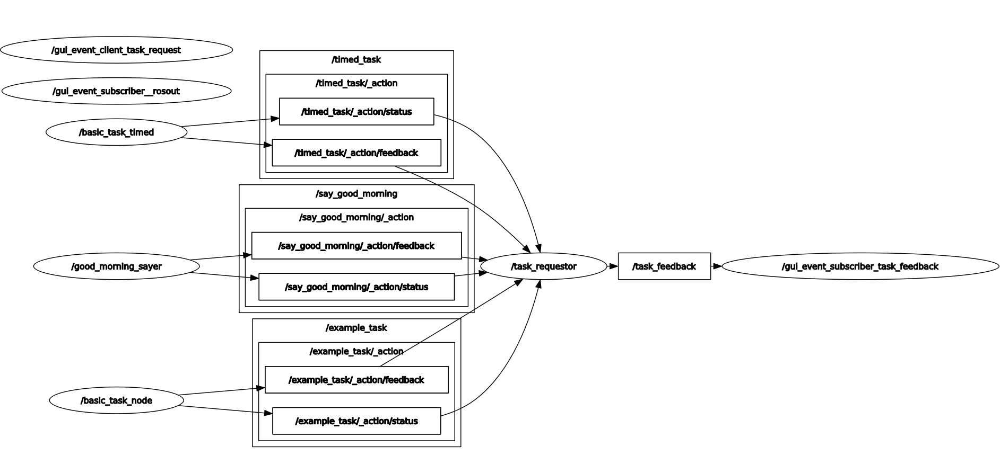

# GUI Package
The GUI comprises PyQt `modules` (imported and positioned by app.py) which
communicate with the logical layer through `event_nodes`. `event_nodes` should
handle all multithreading to prevent GUI hangs. Each module should only send
PyQt signals within itself.

## Node Graph


## Topics
- `task_request`: service topic; GUI's client requests task changes by
`task_scheduler` and `task_scheduler` returns response.
- `task_feedback`: pub/sub topic; `task_selector` tells the GUI to change its
dropdown to reflect network state.
- `/rosout`: pub/sub topic; ROS logging topic that the GUI logger listens to.

## Themes
To run light mode
```
ros2 launch gui gui_launch.y
````
To run dark mode
```
ros2 launch gui gui_launch.py theme:=dark
```
To run watermelon mode (don't)
```
ros2 launch gui gui_launch.py theme:=watermelon
```