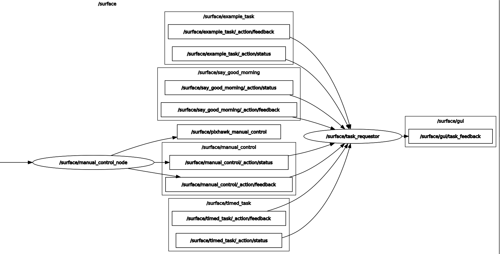

A graph of the nodes used in the task scheduler

The <a href="task_selector/task_selector.py">task scheduler</a> (node name task_selector) advertises a service named `task_request`. Any client can pass a task id, defined by the enumerator Tasks, to this service, and the scheduler will cancel any currently running task to switch to the newly requested task. An example series of requests is found in the  <a href="task_selector/example_request_client.py">example request client</a>.

List of <a href="task_selector/tasks.py">tasks</a>:
* CANCEL: Cancel current task
* EX_BASIC: Example- do nothing and return successful
* EX_TIMED: Example- run a 10 second timer
* EX_GOOD_MORNING: Example- return a greeting depending on the time of day and level of cheeriness
